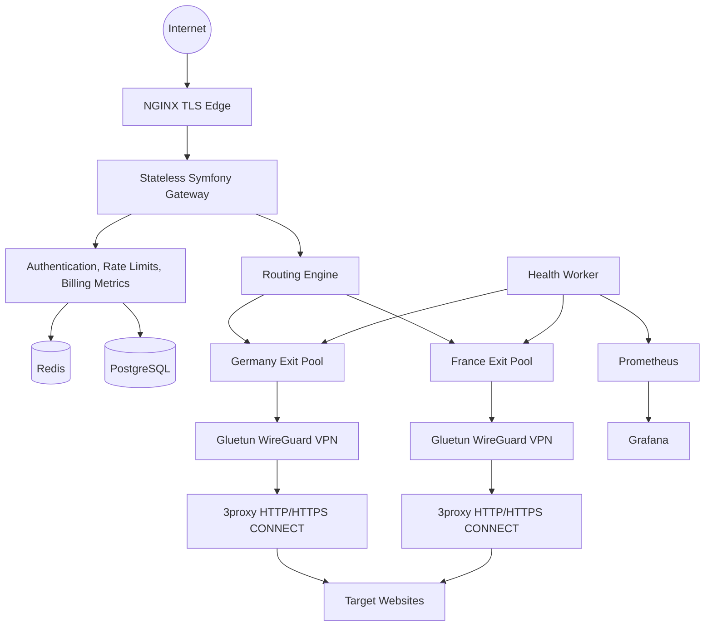

# Architecture

## Request flow

1. Customer authenticates to the proxy with a username such as `de.customer123`.
2. Gateway validates credentials, plan limits, and rate limits.
3. Routing engine extracts country/city/sticky-session hints.
4. Redis stores live node load and sticky mappings.
5. The least-loaded healthy node is selected.
6. Traffic is forwarded to 3proxy sharing the network namespace of its VPN container.
7. Usage events are written asynchronously for billing and analytics.

## Modularity

- Gateway: stateless API and control plane.
- Worker: health checks, usage aggregation, Stripe synchronization.
- Exit pools: independently scaled VPN/proxy pairs per geography.
- Monitoring: Prometheus metrics, Grafana dashboards, Loki logs.

## Scalable multi-client scraping model

The production scaling unit is not one container per customer. The default model is a shared stateless gateway in front of policy-aware routing, per-country exit pools, and queue-backed scraping workers. Customer isolation is enforced logically with routing policies, quotas, per-client concurrency, target allowlists, sticky sessions, and optional dedicated pools for enterprise workloads.

### Routing policy inputs

Each route decision should evaluate:

- client id and plan priority;
- requested country and optional city;
- target domain policy;
- sticky session id;
- current client concurrency;
- healthy nodes in the requested country pool;
- active node load and node weight.

Sticky session mappings use the key shape `sticky:{client}:{country}:{session}` and point to an exit node while it remains healthy. If the sticky node disappears or becomes unhealthy, the router falls back to normal least-loaded selection and stores the new mapping.

### Exit-pool scaling

Use many VPN/proxy exit nodes per country. In Kubernetes, each exit node should be deployed as a VPN sidecar plus proxy sidecar in a pod with a shared network namespace. Scale gateway and scraping workers horizontally; scale country pools from queue depth, active connections, failure rate, latency, and target-specific ban/CAPTCHA rates.

### Queue partitioning

Managed scraping jobs should be partitioned by priority, country, risk level or dedicated pool, and normalized target host, for example `scrape.normal.DE.retail.shop-example-com`. Dedicated enterprise policies use the dedicated pool id in the queue name so workers can reserve capacity without creating one container per customer by default.
