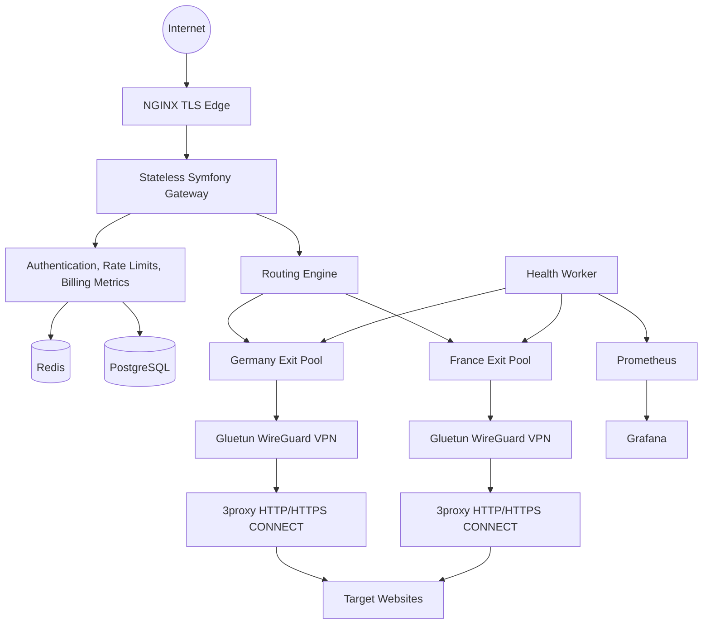

# Architecture

## Request flow

1. Customer authenticates to the proxy with a username such as `de.customer123`.
2. Gateway validates credentials, plan limits, and rate limits.
3. Routing engine extracts country/city/sticky-session hints.
4. Redis stores live node load and sticky mappings.
5. The least-loaded healthy node is selected.
6. Traffic is forwarded to 3proxy sharing the network namespace of its VPN container.
7. Usage events are written asynchronously for billing and analytics.

## Modularity

- Gateway: stateless API and control plane.
- Worker: health checks, usage aggregation, Stripe synchronization.
- Exit pools: independently scaled VPN/proxy pairs per geography.
- Monitoring: Prometheus metrics, Grafana dashboards, Loki logs.
